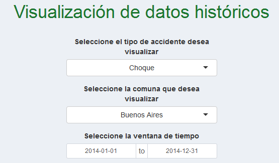
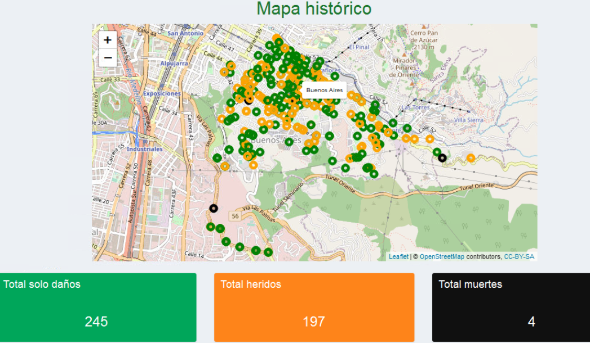
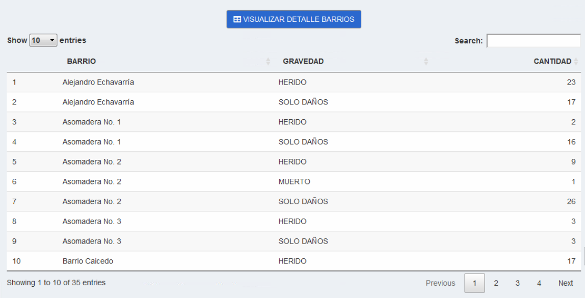
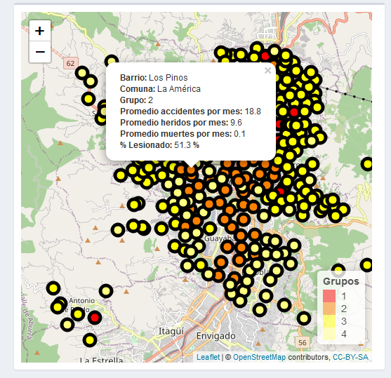

```{r setup, include=FALSE}
knitr::opts_chunk$set(echo = FALSE)
```
```{r load datos, include=FALSE}
load("datos.RData")
```

### Autores: Wilder Camilo Castro Ramos, David Esteban Escobar Castro

### Fecha: 30 de noviembre de 2020.


### INTRODUCCIÓN

Los [datos abiertos de movilidad](https://geomedellin-m-medellin.opendata.arcgis.com/search?tags=movilida) que pública la alcaldía de Medellín, es un insumo muy importante para hacer diferentes análisis estadísticos que pueden ayudar a tomar decisiones más acertadas que permitan mitigar el impacto que tiene la accidentalidad en la Ciudad de Medellín. Estos datos hacen referencia a la información recopilada entre los años 2014 a 2018, sobre incidentes presentados en las vías.

A continuación, se realizará una análisis exploratorio de los datos, que nos permitirá extraer la información más relevante para su estudio El análisis de los datos se divide en tres partes: un análisis histórico de los datos de accidentalidad de la ciudad de Medellín ocurridos entre 2014 y 2018, un análisis predictivo de los datos y el agrupamiento de datos de acuerdo a algunos criterios definidos posteriormente.


### ANÁLISIS EXPLORATORIO

Se tiene la base datos original, en formato CSV, por cada año de reporte desde el 2014 al 2018, inicialmente se juntan esas bases datos en una sola base de datos, para facilitar el análisis. Luego se depuran las columnas que no serán tenidas en cuenta para este estudio y se eliminan filas con valores nulos. 

Por medio de la función str_replace de R, se reemplazan todos los valores de barrios y comunas inconsistentes, al igual que las variables categóricas que tienen inconsistencia o errores ortográficos. Una vez depurada la base de datos, la estructura es la siguiente:

```{r}
head(datosoriginales,5)
```


#### Variables:

A continuación se describen las variables que serán objeto de nuestro estudio:

-	X: indica la longitud del lugar del accidente. 
-	Y: indica la latitud del lugar del accidente.
-	FECHA: indica la fecha de ocurrencia del accidente.
- DIA: indica el dia del año del accidente.
- PERIODO: Año de ocurrencia del accidente.
-	CLASE: indica el tipo de accidente (choque, atropello, caída ocupante, incendio, volcamiento).
-	GRAVEDAD: indica si en el accidente se repotarón heridos, muertos o solo daños.
-	BARRIO: indica el lugar del accidente
-	COMUNA: indica la comuna del barrio donde fue accidente.
- MES: indica el mes del año del accidente.


#### Distribución de los datos:

Analizando los datos que hacen parte de nuestro estudio y una vez depurados, podemos dar un vistazo inicial a como es el comportamiento de nuestros datos.

Podemos visualizar que la clase accidente que más se repite es el choque y, además hay una gran cantidad de accidentes que dejan heridos y solo daños.

```{r fig.align="center"}
library(ggplot2)
library(scales)
g = ggplot(datos, aes(CLASE, fill=GRAVEDAD) ) +
  labs(title = "Accidentes por clase y gravedad")+ylab("Cantidad de accidentes") +
  theme(plot.title = element_text(size = rel(2), colour = "black", hjust = 0.5))
g+geom_bar(position="dodge", color="black") + scale_fill_manual(values = alpha(c("lightsalmon", "gray","lightgoldenrodyellow"), 1)) +
  theme(axis.title.x = element_text(face="bold", size=10), axis.text.x = element_text(angle = 90, hjust = 1))
```


Cuando analizamos los accidentes por comuna, podemos evidenciar que La Candelaria es la comuna de Medellín, con más accidentalidad, seguida de Laureles-Estadio y Castilla, también podemos evidenciar que donde menos se produce accidentalidad es en los corregimientos de y la zona nororiental de la ciudad.


```{r fig.align="center" }
library(forcats)
g = ggplot(datos, aes(fct_infreq(COMUNA)) ) +
  labs(title = "Accidentes por comuna")+ylab("Cantidad de accidentes") + xlab("Comuna")+
  theme(plot.title = element_text(size = rel(2), colour = "black", hjust = 0.5))
g+geom_bar(position="dodge", fill="lightsalmon", color="black")+
  theme(axis.title.x = element_text(face="bold", size=10), axis.text.x = element_text(angle = 90, hjust = 1))
```


Al analizar la accidentalidad por barrio, podemos evidenciar que es en la zona céntrica y sur de la ciudad donde se concentran la mayor parte de accidentes en las vías, estos datos no pueden dar indicios de cómo podremos agrupar categóricamente, más adelante.


```{r fig.align="center" }
g = ggplot(top10Barrio, aes(x=reorder(BARRIO,-n),n ) ) +
  labs(title = "Top 10 accidentalidad por barrio")+ylab("Cantidad de accidentes") + xlab("Barrio")+
  theme(plot.title = element_text(size = rel(2), colour = "black", hjust = 0.5))
g+geom_bar(stat = "identity", fill="lightsalmon", color="black")+
  theme(axis.title.x = element_text(face="bold", size=10), axis.text.x = element_text(angle = 90, hjust = 1))
```


### VISUALIZACIÓN

Para la visualización de los datos, se tuvo en cuenta la clase de accidente, la fecha de ocurrencia del accidente y la comuna. El usuario puede seleccionar la clase de accidente que esté interesado en consultar (choque, incendio, volcamiento, caída de ocupante, atropello y otro), además de una ventana de tiempo y la comuna, como se muestra en la figura:


<div>
<p style = 'text-align:center;'>

</div>


Una vez seleccionadas las variables de consulta, se podrán visualizar en el mapa, donde están agrupadas por gravedad (herido, muerto o solo daños), además de la cantidad de cada suceso. Utilizando la función leaflet de R:
<br>


<div>
<p style = 'text-align:center;'>

</div>


Si se desea ver en detalle por cada barrio el número de accidentes y la gravedad del accidente ocurrido por la clase de accidente seleccionada, se incorporó una opción para ver el detalle de los barrios, con el botón VISUALIZAR DETALLE BARRIOS, que lo que hace es retornar una tabla con el detalle de los barrios de la consulta previamente establecida.


<div>
<p style = 'text-align:center;'>

</div>


### PREDICCIÓN

En este trabajo se abordará el problema de predecir la accidentalidad en la ciudad de Medellín a partir de la historia reciente de los accidentes reportados.


#### Entrenamiento de un modelo predictivo
Se construyen tres modelos que permiten predecir la accidentalidad por tipo de accidente choque a nivel semanal, mensual y diario. Adicionalmente se consideraron fechas especiales.

#### A continuación de realiza el entrenamiento del modelo

Se cargan las librerías necesarias 
```{r}
library(lubridate)
library(caret)
library(data.table)
library('ggplot2')
library(dplyr)
```

Se cargan los datos
```{r}
filenames <- list.files(path = "data/fit/")
datos <- data.table()

i <- 1

for (i in 1:length(filenames)){
  data <- data.table()
  data <- as.data.table(fread(paste("data/fit/",filenames[i],sep = ""), header=TRUE))
  datos <- rbind(datos,data)
}
```


Los datos se ven así:

```{r}
head(datos)
```

Las variables que se van a utilizar en el modelo son:

* FECHA:
* DIA:
* PERIODO: 
* CLASE: 
* DIA_NOMBRE: 
* BARRIO:
* COMUNA:
* MES:

Lo primero que debe hacerse es un análisis descriptivo de los datos. A continuación se presentan algunas medidas de tendencia central y de dispersión:

```{r}
datos_fit <- datos[,c("X","Y","OBJECTID", "RADICADO", "HORA", "DIRECCION", "DIRECCION_ENC", "CBML", "TIPO_GEOCOD",   "MES_NOMBRE","Y_MAGNAMED", "X_MAGNAMED", "LONGITUD", "LATITUD", "GRAVEDAD", "DISENO"):=NULL]
summary(datos_fit)
```

Se modifica la fecha eliminando los últimos números para que el formato funcione
```{r}
datos$FECHA = substr(datos$FECHA,1,10)

head(datos)
```

Se convierte a formato FECHA el respectivo campo

```{r}

#datos$FECHA = parse_date_time(datos$FECHA,"%Y/%m/%d")

datos$FECHA <- as.Date(datos$FECHA) 


head(datos)
```


```{r}
#Voy a mostrar los de clase choque
datos_choque <- datos[datos$CLASE == "Choque"]
ggplot(datos_choque, aes(x=FECHA)) + geom_histogram(binwidth=50, colour="white")
```

Acá se verifica la cantidad de datos que no tienen comuna ni barrio

```{r}
sapply(datos_choque, function(x) sum(as.character(x) == ""))
```
Se borran los datos sin comuna ni barrio para evitar inconvenientes en los datos

```{r}
datos_choque <- datos_choque[!datos_choque$BARRIO == "",]
datos_choque <- datos_choque[!datos_choque$COMUNA == "",]
sapply(datos_choque, function(x) sum(as.character(x) == ""))
```
#### Modelo predictivo de accidentalidad diario por Comuna

A continuación se realiza la transformación de los datos para realizar el modelo. 
Se agregan las fechas especiales al dataframe, se crea una nueva variable, donde 1 es domingo, 1 es festivo y 0 es día normal

```{r}
dias_festivos <- sample(c(0), size = nrow(datos_choque), replace = TRUE)
datos_choque_con_fest <- cbind(datos_choque,dias_festivos)
datos_choque_con_fest[datos_choque_con_fest$DIA_NOMBRE %in% c("DOMINGO"), ]$dias_festivos <- 1

festivos <- c(ymd("2014-01-01"), ymd("2014-12-24"), ymd("2014-12-25"), ymd("2014-12-31"),
              ymd("2015-01-01"), ymd("2015-12-24"), ymd("2015-12-25"), ymd("2015-12-31"),
              ymd("2016-01-01"), ymd("2016-12-24"), ymd("2016-12-25"), ymd("2016-12-31"),
              ymd("2017-01-01"), ymd("2017-12-24"), ymd("2017-12-25"), ymd("2017-12-31"))

datos_choque_con_fest[datos_choque_con_fest$FECHA %in% festivos, "dias_festivos"] <- 2 

head(datos_choque_con_fest)

```


Se realiza una agrupación por periodo, fecha, dia, barrio, comuna, mes, clase y dia_festivo para conocer la cantidad 
```{r}
#freqs <- aggregate(datos_choque$FECHA, by=list(datos_choque$FECHA), FUN=length)
freqs <- aggregate(datos_choque_con_fest$FECHA, by=list(datos_choque_con_fest$PERIODO, datos_choque_con_fest$FECHA,datos_choque_con_fest$DIA, datos_choque_con_fest$BARRIO, datos_choque_con_fest$COMUNA, datos_choque_con_fest$MES, datos_choque_con_fest$CLASE, datos_choque_con_fest$dias_festivos), FUN=length)

#Se cambian los nombres a las columnas
names (freqs) = c("Periodo", "Fecha", "Dia", "Barrio", "Comuna", "Mes", "Clase", "Dia_Fest", "Cantidad")

head(freqs)
```

Se convierten las variables de comuna y barrio en factor y se elimina fecha y clase ya que ya se agrupó

```{r}
datos_conv <- as.data.frame(unclass(freqs))
datos_conv$Barrio <- as.numeric(datos_conv$Barrio)
datos_conv$Comuna <- as.numeric(datos_conv$Comuna)
datos_conv$Comuna <- as.numeric(datos_conv$Comuna)
datos_conv$Fecha <- NULL 
datos_conv$Clase <- NULL 

head(datos_conv)

```

Para el modelamiento se utiliza k vecinos más cercanos, para encontrar el k ideal se utiliza solo el 10% de los datos

```{r}
n<-dim(datos_conv)[1]
n_vl<-round(n*0.90)
set.seed(20190930) # Se fija la semilla para obtener resultados reproducibles
ix_vl<-sample(1:n,n_vl,replace = FALSE)
datos_obtener_k <- datos_conv[-ix_vl, c("Dia", "Barrio",  "Comuna", "Mes", "Dia_Fest", "Cantidad")]
head(datos_obtener_k)
```

Se procede a encontrar el módelo con mejor K

```{r}
ctrl<-trainControl(method = "LGOCV",p=0.75, number = 20)
set.seed(123)
modelo_entrenamiento<-train(Cantidad ~ Dia+Barrio+Comuna+Mes+Dia_Fest,
             data       = datos_obtener_k,
             method     = "knn",
             preProcess = c("center","scale"),
             tuneGrid   = expand.grid(k = 1:30),
             trControl  = ctrl,
             metric     = "RMSE")
```

Se verifica el modelo

```{r}
print(modelo_entrenamiento)
plot(modelo_entrenamiento)
```

Se vuelve a generar el módelo con K=15 que es adecuado según la gráfica pero con todos los datos

```{r}
modelo_entrenamiento2<-train(Cantidad ~ Dia+Barrio+Comuna+Mes+Dia_Fest,
             data       = datos_conv,
             method     = "knn",
             preProcess = c("center","scale"),
             tuneGrid   = expand.grid(k = 15),
             metric     = "RMSE")
```

```{r}
modelo_entrenamiento2
```


Se prueban los datos de entrenamiento y se obtiene un MSE de 35.68

```{r}
modelo_entrenamiento2$finalModel
predicciones_raw <- predict(modelo_entrenamiento2, newdata = datos_conv)
predicciones_raw <- round(predicciones_raw)
error_test <- mean(predicciones_raw != datos_conv$Cantidad)
paste("El error de test del modelo:", round(error_test*100, 2), "%")
```

Se generan los datos de validación

```{r}
datos_v <- as.data.table(fread("data/validate/Incidentes_georreferenciados_2018.csv", sep = ","), header=TRUE)

datos_val <- datos_v[,c("X","Y","OBJECTID", "RADICADO", "HORA", "DIRECCION", "DIRECCION_ENC", "CBML", "TIPO_GEOCOD",   "MES_NOMBRE","Y_MAGNAMED", "X_MAGNAMED", "LONGITUD", "LATITUD", "GRAVEDAD", "DISENO"):=NULL]
datos_v$FECHA = substr(datos_v$FECHA,1,10)
datos_v$FECHA <- as.Date(datos_v$FECHA) 
datos_choque_v <- datos_v[datos_v$CLASE == "Choque"]

datos_choque_v <- datos_choque_v[!datos_choque_v$BARRIO == "",]
datos_choque_v <- datos_choque_v[!datos_choque_v$COMUNA == "",]

dias_festivos <- sample(c(0), size = nrow(datos_choque_v), replace = TRUE)
datos_choque_con_fest_v <- cbind(datos_choque_v,dias_festivos)
datos_choque_con_fest_v[datos_choque_con_fest_v$DIA_NOMBRE %in% c("DOMINGO"), ]$dias_festivos <- 1
festivos <- c(ymd("2018-01-01"), ymd("2018-12-24"), ymd("2018-12-25"), ymd("2018-12-31"))
datos_choque_con_fest_v[datos_choque_con_fest_v$FECHA %in% festivos, "dias_festivos"] <- 2 
#freqs <- aggregate(datos_choque$FECHA, by=list(datos_choque$FECHA), FUN=length)
freqs_v <- aggregate(datos_choque_con_fest_v$FECHA, by=list(datos_choque_con_fest_v$PERIODO, datos_choque_con_fest_v$FECHA,datos_choque_con_fest_v$DIA, datos_choque_con_fest_v$BARRIO, datos_choque_con_fest_v$COMUNA, datos_choque_con_fest_v$MES, datos_choque_con_fest_v$CLASE, datos_choque_con_fest_v$dias_festivos), FUN=length)

#Se cambian los nombres a las columnas
names (freqs_v) = c("Periodo", "Fecha", "Dia", "Barrio", "Comuna", "Mes", "Clase", "Dia_Fest", "Cantidad")
datos_conv_v <- as.data.frame(unclass(freqs_v))
datos_conv_v$Barrio <- as.numeric(datos_conv_v$Barrio)
datos_conv_v$Comuna <- as.numeric(datos_conv_v$Comuna)
datos_conv_v$Fecha <- NULL 
datos_conv_v$Clase <- NULL 

head(datos_conv_v)

```

Se hace la prueba con el modelo y los datos de validación y se encuentra el MSE

```{r}
modelo_entrenamiento2$finalModel
predicciones_v <- predict(modelo_entrenamiento2, newdata = datos_conv_v)
predicciones_v <- round(predicciones_v)
error_test <- mean(predicciones_v != datos_conv_v$Cantidad)
paste("El error de test del modelo:", round(error_test*100, 2), "%")
```

*Se comprueba que la diferencia entre entranamiento y validación es 35.68% - 33.32% que es igual a 2.36% lo que evidencia que no está sobreentrenado*

Ahora se generan todas las combinaciones posibles de las variables utilizadas para el año 2020
```{r}
#Se hace una multiplicación de columnas entre el periodo 2020 y los diferentes días que existan
ano <- c('2020')
dia <- aggregate(datos_conv_v$Dia, by=list(datos_conv_v$Dia), FUN=length)$Group.1
df <- merge(x = ano, y = dia, by = NULL)
#Se multiplica lo que se lleva hasta el momento con la agrupación de barrios y su respectiva comuna
barrio_comuna <- aggregate(datos_conv_v$Barrio, by=list(datos_conv_v$Barrio, datos_conv_v$Comuna), FUN=length)
barrio_comuna <- cbind(barrio_comuna$Group.1, barrio_comuna$Group.2)
df <- merge(x = df, y = barrio_comuna, by = NULL)
#Se multiplica también por los meses del año
mes <- aggregate(datos_conv_v$Mes, by=list(datos_conv_v$Mes), FUN=length)$Group.1
df <- merge(x = df, y = mes, by = NULL)
#Se agregan los días festivos que se han puesto en los otros modelos, que es los domingos y festivos
dias_festivos <- sample(c(0), size = nrow(df), replace = TRUE)
df <- cbind(df,dias_festivos)
names (df) = c("Periodo", "Dia", "Barrio", "Comuna", "Mes", "Dia_Fest")
df[df$Dia %in% c(30), ]$Dia_Fest <- 1
festivos <- c(ymd("2018-01-01"), ymd("2018-12-24"), ymd("2018-12-25"), ymd("2018-12-31"))
df[df$Periodo %in% c("2020") & df$Dia %in% c(10) & df$Mes %in% c(1), ]$Dia_Fest <- 2
head(df)


```

Se realiza la predicción del 2020

```{r}

predicciones_nuevas <- predict(modelo_entrenamiento2, newdata = df)
#predicciones_nuevas <- round(predicciones_nuevas)

```

Se completa la predicción con las otras columnas correspondientes

```{r}
data_frame_pred <- cbind(df, predicciones_nuevas)
fechas<-apply(cbind(2020,data_frame_pred$Mes,data_frame_pred$Dia),1,paste,collapse="-")
fechas<-as.Date(fechas,"%Y-%m-%d")
data_frame_pred <- cbind(data_frame_pred, fechas)
head(data_frame_pred)

```

Se verifica que se pueda graficar, además se agregan los nombres de las comunas

```{r}
datos_conv_v <- as.data.frame(unclass(freqs_v))
datos_conv_v$com_num <- as.numeric(datos_conv_v$Comuna)  
comunas_num <- aggregate(datos_conv_v$com_num, by=list(datos_conv_v$com_num), FUN=length)$Group.1
comunas_nom <- aggregate(datos_conv_v$Comuna, by=list(datos_conv_v$Comuna), FUN=length)$Group.1
data_frame_pred$Comuna_nombre <- cut(data_frame_pred$Comuna, breaks = c(comunas_num,23), labels = comunas_nom, right = FALSE)

d <- data_frame_pred %>%
                filter(Comuna_nombre == "Aranjuez") %>%
                group_by(fechas) %>% summarise(sum = sum(predicciones_nuevas))

ggplot(data = d,aes(x = fechas, y = sum)) + geom_bar(stat="identity")
        
```


Se guarda el objeto donde se realizó la predicción para que sea consultado por la aplicación shiny

```{r}
save(data_frame_pred, file = "Aplicacion/prediccion_diaria.RData")
```

#### Modelo predictivo de accidentalidad semanal por Comuna

A continuación se realiza la transformación de los datos para realizar el modelo. 
A partir de la fecha se obtiene la semana del año correspondiente, también se eliminan las filas con barrios y comunas vacías

```{r}
datos_choque_sem <- datos_choque
datos_choque_sem$semana = week(datos_choque_sem$FECHA)
datos_choque_sem <- datos_choque_sem[!datos_choque_sem$BARRIO == "",]
datos_choque_sem <- datos_choque_sem[!datos_choque_sem$COMUNA == "",]
sapply(datos_choque_sem, function(x) sum(as.character(x) == ""))
```

Se realiza una agrupación por periodo, periodo - semana, barrio, comuna, mes, clase y semana para conocer la cantidad

```{r}
#Se agrega una columna con la semana y el periodo para agruparlas juntas
datos_choque_sem$semana_periodo <- apply(cbind(datos_choque_sem$PERIODO,datos_choque_sem$semana),1,paste,collapse="-")

freq_sem <- aggregate(datos_choque_sem$semana_periodo, by=list(datos_choque_sem$semana_periodo, datos_choque_sem$PERIODO, datos_choque_sem$BARRIO, datos_choque_sem$COMUNA, datos_choque_sem$MES, datos_choque_sem$CLASE, datos_choque_sem$semana), FUN=length)

#Se cambian los nombres a las columnas
names (freq_sem) = c("Periodo_semana","Periodo", "Barrio", "Comuna", "Mes", "Clase","Semana", "Cantidad")
head(freq_sem)

```

Se convierten las variables de comuna y barrio en factor y se elimina periodo_semana y clase ya que ya se agrupó

```{r}
datos_conv_sem <- as.data.frame(unclass(freq_sem))
datos_conv_sem$Barrio <- as.numeric(datos_conv_sem$Barrio)
datos_conv_sem$Comuna <- as.numeric(datos_conv_sem$Comuna)
datos_conv_sem$Periodo_semana <- NULL 
datos_conv_sem$Clase <- NULL 
head(datos_conv_sem)

```

Para el modelamiento se utiliza k vecinos más cercanos, para encontrar el k ideal, se utiliza solo el 20% de los datos por procesos computacionales

```{r}
n<-dim(datos_conv_sem)[1]
n_vl<-round(n*0.80)
set.seed(20190930) # Se fija la semilla para obtener resultados reproducibles
ix_vl<-sample(1:n,n_vl,replace = FALSE)
datos_obtener_k_sem <- datos_conv_sem[-ix_vl, c("Barrio", "Comuna", "Semana", "Cantidad")]
head(datos_obtener_k_sem)
```

Se procede a encontrar el módelo con mejor K

```{r}
ctrl<-trainControl(method = "LGOCV",p=0.75, number = 20)
set.seed(20190930)
modelo_entrenamiento_sem<-train(Cantidad ~ Barrio+Comuna+Semana,
             data       = datos_obtener_k_sem,
             method     = "knn",
             preProcess = c("center","scale"),
             tuneGrid   = expand.grid(k = 1:30),
             trControl  = ctrl,
             metric     = "RMSE")
```

Se verifica el modelo

```{r}
print(modelo_entrenamiento_sem)
plot(modelo_entrenamiento_sem)
```

Se vuelve a generar el módelo con K=8 que es adecuado según la gráfica pero con todos los datos

```{r}
modelo_entrenamiento2_sem<-train(Cantidad ~ Barrio+Comuna+Semana,
             data       = datos_conv_sem,
             method     = "knn",
             preProcess = c("center","scale"),
             tuneGrid   = expand.grid(k = 8),
             metric     = "RMSE")
```

```{r}
modelo_entrenamiento2_sem
```

Se prueban los datos de entrenamiento y se obtiene un MSE de 67.09 %

```{r}
modelo_entrenamiento2_sem$finalModel
predicciones_raw_sem <- predict(modelo_entrenamiento2_sem, newdata = datos_conv_sem)
predicciones_raw_sem <- round(predicciones_raw_sem)
error_test <- mean(predicciones_raw_sem != datos_conv_sem$Cantidad)
paste("El error de test del modelo:", round(error_test*100, 2), "%")
```

Se obtienen los datos para validar

```{r}
datos_choque_v_sem <- datos_choque_v
#Se agrega una columna con la semana y el periodo para agruparlas juntas
datos_choque_v_sem$semana = week(datos_choque_v_sem$FECHA)
datos_choque_v_sem$semana_periodo <- apply(cbind(datos_choque_v_sem$PERIODO,datos_choque_v_sem$semana),1,paste,collapse="-")

freq_sem_v <- aggregate(datos_choque_v_sem$semana_periodo, by=list(datos_choque_v_sem$semana_periodo, datos_choque_v_sem$PERIODO, datos_choque_v_sem$BARRIO, datos_choque_v_sem$COMUNA, datos_choque_v_sem$MES, datos_choque_v_sem$CLASE, datos_choque_v_sem$semana), FUN=length)

#Se cambian los nombres a las columnas
names (freq_sem_v) = c("Periodo_semana","Periodo", "Barrio", "Comuna", "Mes", "Clase","Semana", "Cantidad")

datos_conv_sem_v <- as.data.frame(unclass(freq_sem_v))
datos_conv_sem_v$Barrio <- as.numeric(datos_conv_sem_v$Barrio)
datos_conv_sem_v$Comuna <- as.numeric(datos_conv_sem_v$Comuna)
datos_conv_sem_v$Periodo_semana <- NULL 
datos_conv_sem_v$Clase <- NULL 
head(datos_conv_sem_v)

```

Se hace la prueba con el modelo y los datos de validación y se encuentra el MSE

```{r}
modelo_entrenamiento2_sem$finalModel
predicciones_v_sem <- predict(modelo_entrenamiento2_sem, newdata = datos_conv_sem_v)
predicciones_v_sem <- round(datos_conv_sem_v)
error_test <- mean(predicciones_v_sem != datos_conv_sem_v$Cantidad)
paste("El error de test del modelo:", round(error_test*100, 2), "%")
```

*Se comprueba que la diferencia entre entrenamiento y validación es  67.09% - 80.8% que es igual a 13.71% lo que evidencia que no está sobreentrenado*

Ahora se generan todas las combinaciones posibles de las variables utilizadas para el año 2020

```{r}
#Se hace una multiplicación de columnas con el periodo 2020 
ano <- c('2020')
semana <- aggregate(datos_conv_sem_v$Semana, by=list(datos_conv_sem_v$Semana, datos_conv_sem_v$Mes), FUN=length)
semana <- cbind(semana$Group.1, semana$Group.2)
df <- merge(x = ano, y = semana, by = NULL)
barrio_comuna <- aggregate(datos_conv_sem_v$Barrio, by=list(datos_conv_sem_v$Barrio, datos_conv_sem_v$Comuna), FUN=length)
barrio_comuna <- cbind(barrio_comuna$Group.1, barrio_comuna$Group.2)
df <- merge(x = df, y = barrio_comuna, by = NULL)
names(df) = c("Periodo", "Semana", "Mes", "Barrio", "Comuna")
head(df)

```

Se realiza la predicción del 2020

```{r}

predicciones_nuevas <- predict(modelo_entrenamiento2_sem, newdata = df)

```

Se completa la predicción con las otras columnas correspondientes

```{r}
data_frame_pred_sem <- cbind(df, predicciones_nuevas)
head(data_frame_pred_sem)

```

Se verifica que se pueda graficar, además se agregan los nombres de las comunas

```{r}
datos_conv_v_sem <- as.data.frame(unclass(freq_sem_v))
datos_conv_v_sem$com_num <- as.numeric(datos_conv_v_sem$Comuna)  
comunas_num <- aggregate(datos_conv_v_sem$com_num, by=list(datos_conv_v_sem$com_num), FUN=length)$Group.1
comunas_nom <- aggregate(datos_conv_v_sem$Comuna, by=list(datos_conv_v_sem$Comuna), FUN=length)$Group.1
data_frame_pred_sem$Comuna_nombre <- cut(data_frame_pred_sem$Comuna, breaks = c(comunas_num,23), labels = comunas_nom, right = FALSE)

d_sem <- data_frame_pred_sem %>%
                filter(Comuna_nombre == "Aranjuez") %>%
                group_by(Semana) %>% summarise(sum = sum(predicciones_nuevas))

ggplot(data = d_sem,aes(x = Semana, y = sum)) + geom_bar(stat="identity")
        
```

Se guarda el objeto donde se realizó la predicción para que sea consultado por la aplicación shiny

```{r}
save(data_frame_pred,data_frame_pred_sem, file = "Aplicacion/prediccion_diaria.RData")
```

#### Modelo predictivo de accidentalidad mensual por Comuna

A continuación se realiza la transformación de los datos para realizar el modelo. 
Este modelo es más sencillo, ya que el mes es una variable dada en el conjunto de datos, también se eliminan las filas con barrios y comunas vacías

```{r}
datos_choque_mes <- datos_choque
datos_choque_mes <- datos_choque_mes[!datos_choque_mes$BARRIO == "",]
datos_choque_mes <- datos_choque_mes[!datos_choque_mes$COMUNA == "",]
sapply(datos_choque_mes, function(x) sum(as.character(x) == ""))
```

Se realiza una agrupación por periodo, periodo - mes, barrio, comuna, mes y clase para conocer la cantidad

```{r}
#Se agrega una columna con mes y el periodo para agruparlas juntas
datos_choque_mes$mes_periodo <- apply(cbind(datos_choque_mes$PERIODO,datos_choque_mes$MES),1,paste,collapse="-")

freq_mes <- aggregate(datos_choque_mes$mes_periodo, by=list( datos_choque_mes$PERIODO, datos_choque_mes$BARRIO, datos_choque_mes$COMUNA, datos_choque_mes$MES, datos_choque_mes$CLASE), FUN=length)

#Se cambian los nombres a las columnas
names (freq_mes) = c("Periodo", "Barrio", "Comuna", "Mes", "Clase", "Cantidad")
head(freq_mes)

```

Se convierten las variables de comuna y barrio en factor y se elimina periodo_semana y clase ya que ya se agrupó

```{r}
datos_conv_mes <- as.data.frame(unclass(freq_mes))
datos_conv_mes$Barrio <- as.numeric(datos_conv_mes$Barrio)
datos_conv_mes$Comuna <- as.numeric(datos_conv_mes$Comuna)
datos_conv_mes$Clase <- NULL 
head(datos_conv_mes)
```

Para el modelamiento se utiliza k vecinos más cercanos, para encontrar el k ideal, se utiliza solo el 40% de los datos por procesos computacionales

```{r}
n<-dim(datos_conv_mes)[1]
n_vl<-round(n*0.60)
set.seed(20190930) # Se fija la semilla para obtener resultados reproducibles
ix_vl<-sample(1:n,n_vl,replace = FALSE)
datos_obtener_k_mes <- datos_conv_mes[-ix_vl, c("Barrio", "Comuna", "Mes", "Cantidad")]
head(datos_obtener_k_mes)
```

Se procede a encontrar el módelo con mejor K

```{r}
ctrl<-trainControl(method = "LGOCV",p=0.75, number = 20)
set.seed(20190930)
modelo_entrenamiento_mes <-train(Cantidad ~ Barrio+Comuna+Mes,
             data       = datos_obtener_k_mes,
             method     = "knn",
             preProcess = c("center","scale"),
             tuneGrid   = expand.grid(k = 1:30),
             trControl  = ctrl,
             metric     = "RMSE")
```

Se verifica el modelo

```{r}
print(modelo_entrenamiento_mes)
plot(modelo_entrenamiento_mes)
```

Se vuelve a generar el módelo con K=11 que es adecuado según la gráfica pero con todos los datos

```{r}
modelo_entrenamiento2_mes<-train(Cantidad ~ Barrio+Comuna+Mes,
             data       = datos_conv_mes,
             method     = "knn",
             preProcess = c("center","scale"),
             tuneGrid   = expand.grid(k = 11),
             metric     = "RMSE")
```

```{r}
modelo_entrenamiento2_mes
```

Se prueban los datos de entrenamiento

```{r}
modelo_entrenamiento2_mes$finalModel
predicciones_raw_mes <- predict(modelo_entrenamiento2_mes, newdata = datos_conv_mes)
predicciones_raw_mes <- round(predicciones_raw_mes)
error_test <- mean(predicciones_raw_mes != datos_conv_mes$Cantidad)
paste("El error de test del modelo:", round(error_test*100, 2), "%")
```

Se obtienen los datos para validar

```{r}
datos_choque_v_mes <- datos_choque_v

#Se agrega una columna con mes y el periodo para agruparlas juntas
datos_choque_v_mes$mes_periodo <- apply(cbind(datos_choque_v_mes$PERIODO,datos_choque_v_mes$MES),1,paste,collapse="-")

freq_mes_v <- aggregate(datos_choque_v_mes$mes_periodo, by=list( datos_choque_v_mes$PERIODO, datos_choque_v_mes$BARRIO, datos_choque_v_mes$COMUNA, datos_choque_v_mes$MES, datos_choque_v_mes$CLASE), FUN=length)

#Se cambian los nombres a las columnas
names (freq_mes_v) = c("Periodo", "Barrio", "Comuna", "Mes", "Clase", "Cantidad")

datos_choque_v_mes <- as.data.frame(unclass(freq_mes_v))
datos_choque_v_mes$Barrio <- as.numeric(datos_choque_v_mes$Barrio)
datos_choque_v_mes$Comuna <- as.numeric(datos_choque_v_mes$Comuna)
datos_choque_v_mes$Clase <- NULL 

```

Se hace la prueba con el modelo y los datos de validación y se encuentra el MSE

```{r}
modelo_entrenamiento2_mes$finalModel
predicciones_v_mes <- predict(modelo_entrenamiento2_mes, newdata = datos_choque_v_mes)
predicciones_v_mes <- round(predicciones_v_mes)
error_test <- mean(predicciones_v_mes != datos_choque_v_mes$Cantidad)
paste("El error de test del modelo:", round(error_test*100, 2), "%")
```

*Se comprueba que la diferencia entre entranamiento y validación es  90.88% - 93.46% que es igual a 2.58% lo que evidencia que no está sobreentrenado*

Ahora se generan todas las combinaciones posibles de las variables utilizadas para el año 2020

```{r}
#Se hace una multiplicación de columnas con el periodo 2020 
ano <- c('2020')
mes <- aggregate(datos_choque_v_mes$Mes, by=list(datos_choque_v_mes$Mes), FUN=length)$Group.1
df <- merge(x = ano, y = mes, by = NULL)
barrio_comuna <- aggregate(datos_choque_v_mes$Barrio, by=list(datos_choque_v_mes$Barrio, datos_choque_v_mes$Comuna), FUN=length)
barrio_comuna <- cbind(barrio_comuna$Group.1, barrio_comuna$Group.2)
df <- merge(x = df, y = barrio_comuna, by = NULL)
names(df) = c("Periodo", "Mes", "Barrio", "Comuna")
head(df)
```

Se realiza la predicción del 2020

```{r}

predicciones_nuevas <- predict(modelo_entrenamiento2_mes, newdata = df)

```

Se completa la predicción con las otras columnas correspondientes

```{r}
data_frame_pred_mes <- cbind(df, predicciones_nuevas)
head(data_frame_pred_mes)

```

Se verifica que se pueda graficar, además se agregan los nombres de las comunas

```{r}
datos_conv_v_mes <- as.data.frame(unclass(freq_sem_v))
datos_conv_v_mes$com_num <- as.numeric(datos_conv_v_mes$Comuna)  
comunas_num <- aggregate(datos_conv_v_mes$com_num, by=list(datos_conv_v_mes$com_num), FUN=length)$Group.1
comunas_nom <- aggregate(datos_conv_v_mes$Comuna, by=list(datos_conv_v_mes$Comuna), FUN=length)$Group.1
data_frame_pred_mes$Comuna_nombre <- cut(data_frame_pred_mes$Comuna, breaks = c(comunas_num,23), labels = comunas_nom, right = FALSE)

d_mes <- data_frame_pred_mes %>%
                filter(Comuna_nombre == "Aranjuez") %>%
                group_by(Mes) %>% summarise(sum = sum(predicciones_nuevas))

ggplot(data = d_mes,aes(x = Mes, y = sum)) + geom_bar(stat="identity") + scale_x_continuous(breaks=c(1,2,3,4,5,6,7,8,9,10,11,12))
        
```

Se guarda el objeto donde se realizó la predicción para que sea consultado por la aplicación shiny

```{r}
save(data_frame_pred,data_frame_pred_sem,data_frame_pred_mes, file = "Aplicacion/prediccion_diaria.RData")
```

### AGRUPAMIENTO


Con la base de datos depurada se subdivide en tres grupos de datos:


-	La primera base de datos resume los datos agrupados por barrios y comunas, cuando la gravedad del accidente es HERIDO y se crea la variable PROMEDIO_HERIDOS_x_MES.


```{r}
head(datos3,5)
```


-	La segunda base de datos resume los datos agrupados por barrios y comunas, cuando la gravedad del accidente es MUERTO y se crea la variable PROMEDIO_MUERTES_X_MES.


```{r}
head(datos4,5)
```


La tercera base de datos resume los datos agrupados por barrios y comunas, cuando la gravedad del accidente es SOLO DAÑOS y se crea la variable PROMEDIO_DAÑOS_X_MES.


```{r}
head(datos5,5)
```


Luego se unifican las bases de datos en una sola base de datos, además lo valores nulos o NA para las variables calculadas anteriormente se reemplazan por 0. Se crean dos nuevas variables, que son TOTAL_ACCIDENTES1 y TOTAL_ACCIDENTES, donde:


-	TOTAL_ACCIDENTES1: es la suma total de los accidentes en el barrio.

-	TOTAL_ACCIDENTES: es la suma total de los accidentes en el barrio, cuya gravedad es herido o muerto.

- POR_HERIDOS: indica que porcentaje sobre los accidentes totales, derivaron en hechos donde se produjeron heridos o muertos.


```{r}
head(muestra,5)
```


A continuación, se crea un data frame con las variables que van a ser utilizadas para clusterización de los barrios, que serán TOTAL_ACCIDETNES1 y POR_HERIDOS.


```{r}
head(cluster_barrios,5)
```


Finalmente se escalan los datos con la función scale de R, para evitar problemas de dimensionamiento.


```{r}
head(cluster_barrio,5)
```


Para encontrar el k óptimo de clusters, aplicaremos el método del codo ó Elbow Method, a partir de la optimización del WCSS, el cual se basa fundamentalmente en agrupar los datos de entrada en un total de k conjuntos definidos por el centroide, cuya distancia con los puntos que pertenecen a cada uno de los datos es la menor posible. Evaluando posibles valores de k entre 1 y 10.


```{r fig.align="center" }
data.frame(n_clusters = 1:10, wscc = total_withinss)%>%
  ggplot(aes(x=n_clusters, y=wscc)) + 
   theme(plot.title = element_text(size = rel(2), colour = "black", hjust = 0.5))+
  geom_line() +
  geom_point() +
  scale_x_continuous(breaks = 1:10) +
  labs(title = "Metodo del codo") +
  theme_bw()
```


Al evaluar el resultado, se evidencia que la gráfica tiene a ser más estable en k=4, es por esto que se decide trabajar con un k=4.


Se deciden tener en cuenta para la separación de grupos, dos parámetros de selección:

- Accidentalidad: se considerará un barrio con accidentalidad alta aquellos donde se superen los 15 accidentes por mes. Si la cantidad es menor a 15 accidentes por mes se considerará accidentalidad baja.

- Probabilidad de lesiones: se considerará un barrio con una alta probabilidad de lesiones aquellos que superen un 60% de accidentes que resultaron en heridos o muertos, sobre el total de accidentes. Si es menor a 60% se considerará baja probabilidad de lesiones.

Los grupos serán definidos de acuerdo a los paramétros anteriores de la siguiente manera:

- Grupo 1: Barrios de alta accidentalidad con una alta probabilidad de lesiones.

- Grupo 2: Barrios de alta accidentalidad con una baja probabilidad de lesiones.

- Grupo 3 : Barrios de baja accidentalidad con una alta probabilidad de lesiones.

- Grupo 4 : Barrios de baja accidentalidad con una baja probabilidad de lesiones.

Al aplicar el agrupamiento de los datos, el data frame queda definido con su número de grupo.


```{r}
head(datosBase,5)
```


Los barrios quedaron distribuidos en los grupos de la siguiente forma:


```{r fig.align="center" }
head(grupoBarrios,4)
```


A continuación con la librería leaflet de R, se grafican estos grupos en el mapa de acuerdo con su ubicación segun el promedio de su longitud, y latitud por barrio, asignándole un color a cada grupo.


<div>
<p style = 'text-align:center;'>

</div>


#### Características espaciales:


Se encuentra que los barrios con mayor accidentalidad se encuentran ubicados en el centro, centro-norte y centro- sur de la ciudad, teniendo los barrios del centro-norte en su mayoría una alta probabilidad de salir lesionado en el accidente, mientras que en el centro y centro sur de la ciudad la probabilidad es baja.

Los barrios con una baja accidentalidad se concentran en las periferias de la ciudad (oriente y occidente), además en los 5 corregimientos, en su mayoría con una alta probabilidad de salir lesionado en el accidente, exceptuando zonas como la parte alta del poblado, robledo parte media y una parte de Bélen.

#### Retos que el agrupamiento puede resolver:


El agrupamiento puede ayudar a las autoridades a focalizar esas zonas de la ciudad con mayor accidentalidad, además de priorizar aquellas zonas donde ocurren más accidentes que desatan en heridos o muertos.

Para el grupo 1, se recomienda analizar el motivo por el que se están presentando estos grandes índices de accidentalidad con una alta probabilidad de salir lesionados, podría ser factores como el exceso de velocidad, ya que al estar concentrado en las zonas céntricas, más hacia el norte de la ciudad, donde hay mayor tramo de vía y son más amplias para la circulación, se recomienda además, una mayor disponibilidad de ambulancias, cámaras de seguridad y agentes de tránsito en estos barrios.

Para el grupo 2, se recomienda igualmente una intervención priorizada de las autoridades, donde se pueda contar igualmente con buena disponibilidad de ambulancias, agentes de tránsito y cámaras de seguridad, para evaluar cuál es la principal causa de accidentalidad.

Para el grupo 3 se evidencia una baja accidentalidad, pero con alta probabilidad de salir lesionado, en este grupo se recomienda a las autoridades realizar mas campañas de concientización vial y además evaluar que puede estar pasando estructuralmente con las vías, si encuentran en buen estado, y que puede estar ocasionando estos accidentes.

Para el grupo 4, se evidencia una baja accidentalidad y baja probabilidad de lesiones, en estos grupos no es recomendable intervenir, ya que se le debe dar prioridad a los grupos anteriores.

### Referencias

* https://www.diegocalvo.es/analisis-de-series-temporales-en-r-arima/
* https://rpubs.com/palominoM/series
* https://stat.ethz.ch/pipermail/r-help-es/2009-November/000433.html
* https://www.diegocalvo.es/manipulacion-datos-r-forma-simple/
* https://www.iteramos.com/pregunta/51161/la-comprension-de-las-fechas-y-el-trazado-de-un-histograma-con-ggplot2-en-r
* https://es.r4ds.hadley.nz/fechas-y-horas.html
* https://www.institutomora.edu.mx/testU/SitePages/martinpaladino/series_de_tiempo_con_R.html#agregar-series-de-tiempo-en-anos-semestres-trimestres.
* http://estadistica-dma.ulpgc.es/cursoR4ULPGC/14-seriesTemporales.html
* https://www.earthdatascience.org/courses/earth-analytics/time-series-data/date-class-in-r/
* http://www.scielo.org.co/pdf/dyna/v78n165/a30v78n165.pdf
* https://www.r-bloggers.com/2018/07/how-to-aggregate-data-in-r/
* https://rpubs.com/Rortizdu/140158
* https://biocosas.github.io/R/020_gestion_datos.html
* https://bookdown.org/content/2274/metodos-de-clasificacion.html#algoritmo-k-vecinos-mas-cercanos
* https://es.quora.com/C%C3%B3mo-puedo-eliminar-variables-columnas-en-RStudio
* https://danielredondo.com/posts/20200219_calendario_laboral/
* https://topepo.github.io/caret/model-training-and-tuning.html
* https://dataaspirant.com/knn-implementation-r-using-caret-package/
